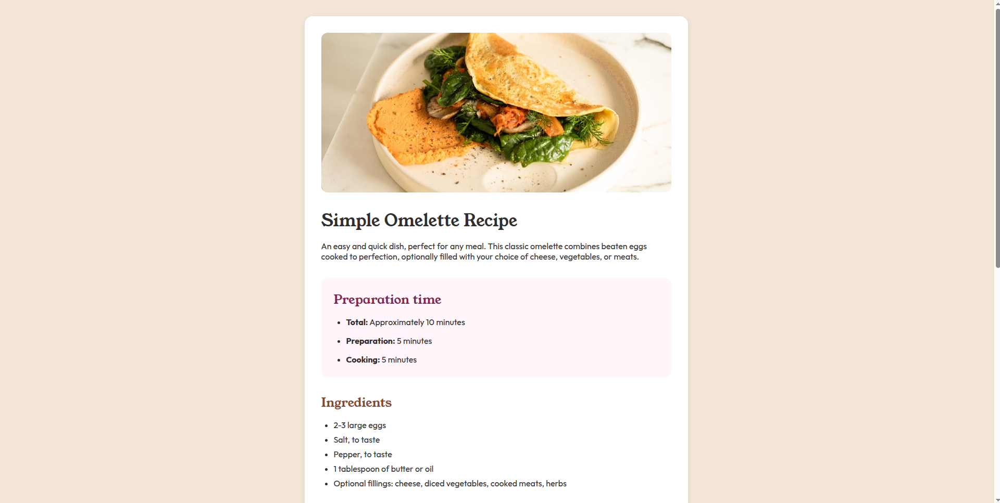

# Frontend Mentor - Recipe page solution

This is a solution to the [Recipe page challenge on Frontend Mentor](https://www.frontendmentor.io/challenges/recipe-page-KiTsR8QQKm). Frontend Mentor challenges help you improve your coding skills by building realistic projects.

## Table of contents

- [Frontend Mentor - Recipe page solution](#frontend-mentor---recipe-page-solution)
  - [Table of contents](#table-of-contents)
  - [Overview](#overview)
    - [The challenge](#the-challenge)
    - [Screenshot](#screenshot)
    - [Links](#links)
  - [My process](#my-process)
    - [Built with](#built-with)
    - [What I learned](#what-i-learned)
    - [Continued development](#continued-development)
    - [Useful resources](#useful-resources)

## Overview

### The challenge

Users should be able to:
- View the optimal layout depending on their device's screen size
- See hover states for interactive elements
- Navigate through recipe instructions clearly
- Access nutritional information in table format

### Screenshot

 

### Links

- Solution URL: [Add solution URL here](https://your-solution-url.com)
- Live Site URL: [Add live site URL here](https://your-live-site-url.com)

## My process

### Built with

- Semantic HTML5 markup
- CSS custom properties
- Flexbox
- CSS Grid
- Mobile-first workflow
- CSS custom counters
- Interactive hover states

### What I learned

Key implementations in HTML:
```html
<!-- Custom numbered list with CSS counters -->
<ol class="steps">
  <li>
    <span class="step-title">Beat the eggs:</span>
    <span class="step-desc">In a bowl, beat the eggs...</span>
  </li>
</ol>

<!-- Nutrition table implementation -->
<table>
  <tr>
    <td>Calories</td>
    <td>277kcal</td>
  </tr>
</table>

<!-- Semantic sectioning -->
<section class="instructions">
  <h2>Instructions</h2>
  <!-- content -->
</section>
```

Key CSS implementations:

```css
/* Custom list numbering */
.steps li::before {
  content: counter(step-counter) ".";
  color: var(--brown-800);
  font-weight: bold;
}

/* Hover effects */
.steps li:hover {
  background-color: var(--stone-100);
  transition: background-color 0.2s ease;
}

/* Responsive image handling */
.thumbnail img {
  width: 100%;
  height: auto;
  border-radius: 0.75rem;
}

/* Mobile-first media query */
@media (max-width: 768px) {
  main {
    padding: 1.5rem;
  }
}
```

### Continued development

- Add more recipe variations
- Create a recipe gallery frontpage
- Implement dark mode
- Add cooking timer functionality

### Useful resources

- [MDN Web Docs - CSS](https://developer.mozilla.org/en-US/docs/Web/CSS) - This comprehensive resource helped me understand the details of CSS properties like object-fit and the gap property. Their examples are clear and practical.
- [W3Schools - CSS Tutorial](https://www.w3schools.com/css/) - This site provided easy-to-follow examples for implementing hover effects and transitions. I particularly found their interactive examples helpful for understanding transform properties.
- [CSS-Tricks - A Complete Guide to Flexbox](https://css-tricks.com/snippets/css/a-guide-to-flexbox/) - This guide helped me properly implement the flexbox layout to structure my card component.
